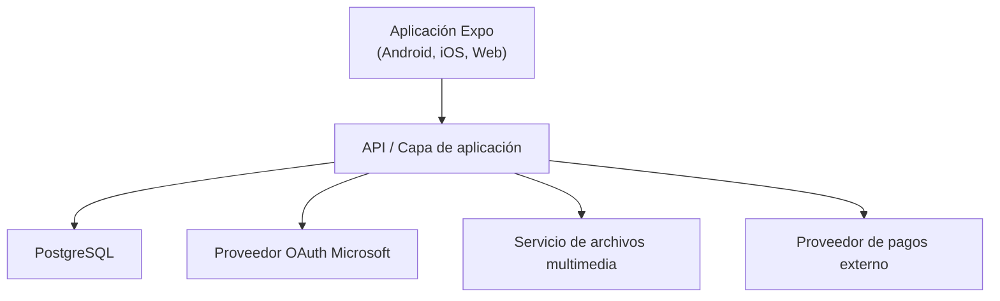

# MarketplaceNative

Aplicacion movil para la venta e intercambio de productos entre miembros de una institucion educativa. Es un proyecto academico y de portafolio orientado a demostrar flujos de publicacion, intercambio seguro, moderacion y auditoria.

**[Proyecto en desarrollo]**
La interfaz inicial esta en construccion, el backend, la base de datos, la autenticacion y la integracion de pagos aun no estan implementados.

## Alcance

La plataforma permite que usuarios institucionales publiquen productos para venta, intercambio o ambas modalidades. En los intercambios, un ofertante puede proponer uno de sus productos y agregar un monto de diferencia cuando su valor referencial sea menor. La negociacion ocurre mediante un chat privado asociado a cada solicitud.

## Estado actual

Implementado en el cliente:

- Aplicacion Expo con React Native, TypeScript y Expo Router.
- Rutas iniciales para autenticacion, marketplace, detalle de producto y publicacion.
- Sistema basico de tema, tipografia Plus Jakarta Sans y componentes reutilizables de interfaz.
- Configuracion para Android, iOS y web.

Pendiente de implementacion:

- API, logica de dominio, base de datos y almacenamiento de archivos.
- Autenticacion con Microsoft y validacion de dominio institucional.
- Persistencia de productos, solicitudes, chats, transacciones y auditoria.
- Captura de evidencia multimedia, notificaciones, moderacion y proveedor de pagos.

## Tecnologias actuales

| Capa                   | Tecnologia                                            |
| ---------------------- | ----------------------------------------------------- |
| Cliente movil y web    | Expo SDK 57, React Native 0.86 y React 19             |
| Navegacion             | Expo Router con rutas basadas en archivos             |
| Lenguaje               | TypeScript con modo estricto                          |
| Estilos                | Componentes React Native y tema propio en `src/theme` |
| Base de datos objetivo | PostgreSQL                                            |

## Arquitectura objetivo

La solucion se plantea como una arquitectura cliente-servidor. La aplicacion nunca debe conectarse directamente a PostgreSQL ni a un proveedor de pagos.



Responsabilidades por capa:

- Cliente: presenta la interfaz, captura o selecciona multimedia segun la modalidad, consume la API y muestra el estado de las operaciones.
- API: aplica autenticacion, autorizacion por rol, reglas de negocio, transiciones de estado, coordinacion con servicios externos y registro de auditoria.
- PostgreSQL: conserva datos relacionales y el historial necesario para trazabilidad. Se emplean nombres en espanol y PascalCase.
- Almacenamiento multimedia: conserva fotografias y videos; la base de datos guarda sus metadatos, propietario, tipo, finalidad y referencia de almacenamiento.
- Proveedor de pagos: administra dinero real y comunica el resultado de las operaciones a la API mediante una integracion autenticada.

## Estructura del cliente

```txt
src/
  app/                 Rutas de Expo Router y pantallas
  components/
    common/            Componentes visuales reutilizables de secciones
    sections/          Secciones de pantallas por caso de uso
    ui/                Componentes visuales reutilizables
  theme/               Colores, espaciado, tipografia y primitivas
  global.css           Estilos globales para web
assets/                Fuentes y imagenes de la aplicacion
```

Las rutas actuales viven en `src/app`. El alias `@/` resuelve hacia `src/`, definido en `tsconfig.json`.

## Dominio funcional

### Usuarios y acceso

Existen tres roles: `Administrador`, `Moderador` y `Usuario`.

- La autenticacion se realizara con Microsoft OAuth.
- Solo se permitiran cuentas institucionales autorizadas, por ejemplo, correos con el dominio `@utp.edu.pe`.
- Cada usuario se asocia a una `Sede` institucional.
- La `SedeId` tambien se guarda en el producto para poder mostrar la sede de una publicacion sin requerir que el visitante inicie sesion.
- Administradores y moderadores operan desde el frontend; el acceso directo a la base de datos queda restringido a los propietarios del sistema.

### Catalogo y publicaciones

- Las `Categoria` agrupan `Subcategoria`.
- Un `Producto` pertenece a un usuario, categoria, subcategoria y sede.
- Las modalidades son `Venta`, `Intercambio` y `Ambas`.
- Los atributos variables se modelan por categoria o subcategoria para evitar columnas especificas por cada tipo de producto.
- Los archivos multimedia se relacionan con el producto y deben registrar tipo, orden, origen y proposito.

Reglas de evidencia:

- Para productos de modalidad `Intercambio` o `Ambas`, las fotografias y al menos un video deben capturarse desde la aplicacion y registrarse como evidencia previa.
- Para productos de modalidad `Venta`, las fotografias pueden capturarse desde la aplicacion o seleccionarse desde la galeria.
- La evidencia previa debe permanecer vinculada a la publicacion para que pueda ser consultada durante una disputa.

### Solicitudes, chat y transacciones

Una `SolicitudIntercambio` relaciona el producto publicado, el producto ofrecido y un monto adicional opcional. Cada solicitud tiene su propio chat privado entre el publicador y el ofertante.

Flujo principal:

1. El usuario A publica un producto con valor referencial y modalidad `Intercambio` o `Ambas`.
2. El usuario B ofrece otro producto y, si corresponde, un monto adicional.
3. La solicitud habilita un chat privado para negociar.
4. El usuario A puede recibir multiples solicitudes y aceptar solo una.
5. Al aceptar, ambos productos se reservan, las otras solicitudes se rechazan y sus chats pasan a solo lectura.
6. Se crea una `Transaccion` y se solicitan las retenciones necesarias al proveedor externo.
7. El chat de la transaccion permite coordinar fecha, hora y una sede institucional registrada para el encuentro.
8. Tras el intercambio presencial, ambas partes confirman su conformidad.
9. Con ambas confirmaciones se solicita la liberacion de fondos. Si no hay respuesta ni reclamos durante 24 horas, se ejecuta la liberacion automatica.

### Cancelaciones y disputas

- El ofertante puede cancelar una solicitud mientras este pendiente.
- Una transaccion puede cancelarse antes de marcar el intercambio como realizado.
- Al cancelar, los productos reservados vuelven a estar activos.
- Si hay fondos retenidos, la transaccion solo se considera cancelada cuando el proveedor confirma la anulacion o el reembolso.
- Despues de marcar el intercambio como realizado, los incidentes se gestionan mediante una `Disputa`, no mediante cancelacion normal.
- Un moderador evalua la evidencia previa y la evidencia aportada durante la disputa para decidir liberaciones, devoluciones de dinero y, cuando aplique, devoluciones de productos.

## Ejecucion local

Requisitos: Node.js LTS y npm.

```bash
npm install
npm start
```

Comandos disponibles:

```bash
npm run android
npm run ios
npm run web
```

La aplicacion puede abrirse en un emulador Android, simulador iOS, navegador web o entorno compatible con Expo durante el desarrollo.
